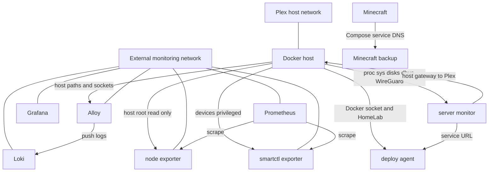
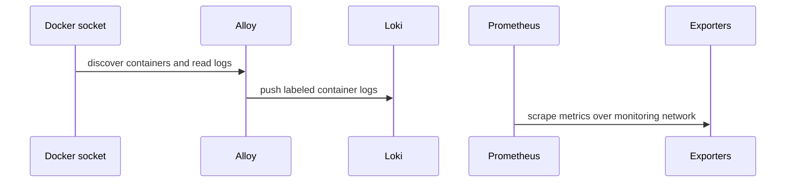

# Docker, Storage, and Network Boundaries

This repository uses bind mounts rather than Docker-managed named volumes. That makes the Compose directories and explicitly named host paths the owners of service state: changing, moving, or replacing those paths changes what a container sees. The Compose files also use several different connectivity models—ordinary Compose networking, an externally managed monitoring network, host networking, and host-gateway access—so a container's ability to reach another service is not uniform.

## Boundary map

*The diagram shows the principal network and host-boundary relationships declared by the Compose files; it is not a complete port inventory.*

## Network choices and service reachability

### The shared monitoring plane

Alloy, Grafana, Loki, Prometheus, node-exporter, and smartctl-exporter attach to an external Docker network named `monitoring`. Because each Compose project declares that network as `external: true`, Docker Compose does not own its lifecycle or create it as part of bringing up one project. The network must already exist, and removing or renaming it breaks cross-project service-name resolution and connectivity until the attachment configuration is corrected.

Within that network, Prometheus scrapes `node-exporter:9100` and `smartctl-exporter:9633` (and also expects `fail2ban-exporter:9191`). Alloy discovers containers through the Docker socket and sends their logs to `http://loki:3100/loki/api/v1/push`. Grafana is attached to the same network but has no declared dependency or data-source configuration in this repository. The monitoring services additionally publish host ports `12345`, `3000`, `3100`, `9090`, and `9633`; those published ports are host exposure, not a substitute for the internal monitoring network.

*The monitoring flow separates Docker-socket log collection from Prometheus exporter scraping.*

The Alloy socket mount is read-only at `/var/run/docker.sock`, but access to the Docker API is still a powerful host control boundary. Its persistent state is `./data` at `/var/lib/alloy/data`, while its configuration is the read-only `./config.alloy` mount. Loki keeps filesystem-backed chunks, indexes, compactor data, and rules below `/loki`, backed by `./data`; its configuration is read-only. Loki is configured for single-process, filesystem storage with a 30-day retention period. Prometheus keeps its TSDB below `/prometheus`, backed by `./data`, and reads `./prometheus.yml` read-only. Grafana's `/var/lib/grafana` is backed by its local `./data` directory.

### Ordinary Compose boundaries

Minecraft does not declare a custom network. Its `minecraft` and `minecraft-backup` services therefore use the Compose project's default network, where the backup container reaches the server as `minecraft` through the `RCON_HOST` setting. Only the server's host port `55555` is published to container port `25565`; the backup service publishes no port. The backup waits for the Minecraft service's health condition, runs after an initial five-minute delay and then hourly, skips backups when there are no players, and retains 24 backups. It mounts the world/data directory read-only at `/data` and writes backups to `./backups` at `/backups`.

The server-monitor project likewise uses its default Compose network: `server-monitor` reaches `deploy-agent` at `http://deploy-agent:9000`. Server-monitor publishes `8080:8000`, and deploy-agent publishes `9000:9000`. These are separate from the monitoring network; nothing in these Compose files attaches server-monitor or deploy-agent to `monitoring`.

Plex is the exception to container-network isolation: `network_mode: host` places it directly on the host network namespace. Its configuration is a host-specific bind mount from `/home/sparrow/HomeLab/plex/config/Application Support/Plex Media Server` to `/config`, and `/mnt/media` to `/media`. There is no container-side port mapping for Plex. Server-monitor instead uses `host.docker.internal:host-gateway` and `PLEX_WEB_HOST=host.docker.internal`, `PLEX_WEB_PORT=32400` to address Plex through the host gateway.

## Host access and privilege boundaries

The monitoring exporters have deliberately different host access profiles:

- `node-exporter` mounts `/` as `/host` read-only, with `rslave` propagation, and is told to inspect it through `--path.rootfs=/host`. This is a broad read-only view of the host filesystem, not a private service volume.
- `smartctl-exporter` runs as `root` with `privileged: true` and mounts host `/dev` at `/hostdev`. This is required for disk health inspection but gives the container substantially broader device access than an ordinary exporter. Its `--smartctl.powermode-check=never` setting avoids power-mode checks during collection.
- Alloy and deploy-agent have Docker socket access. Alloy's socket is read-only; deploy-agent's `/var/run/docker.sock` mount is read-write, so deploy-agent is a high-impact host control point even though the Compose file does not mark it privileged.

Server-monitor has `pid: host` and read-only mounts for `/proc`, `/sys`, `/mnt/disk1`, `/mnt/disk2`, and the system D-Bus socket. Its environment maps `SYSFS_PATH` to `/sys`, identifies `sda` and `sdb` as the monitored storage disks, and identifies `sdc` as `ROOT_BLOCK_DEVICE`. It also mounts the WireGuard directory read-only at `/wireguard` and `/usr/bin/wg` read-only. Those mounts support host health, storage, D-Bus, and VPN inspection; changing host mount points requires changing both the Compose file and the corresponding service assumptions.

Deploy-agent has a wider write surface: it mounts the whole host HomeLab tree at `/home/sparrow/HomeLab`, the host Docker socket read-write, and the host SSH directory read-only at `/root/.ssh`. Its deployment status is persisted at `/home/sparrow/HomeLab/server-monitor/.deploy-status.json`. Treat changes to this service, its image, or its socket mount as host-administration changes, not routine application-container changes.

## Storage ownership and safe operations

There are no named volumes in the supplied Compose definitions. The important persistent boundaries are:

| Service or role | Container path | Repository or host backing path | Mode and implication |
| --- | --- | --- | --- |
| Minecraft | `/data` | `./data` | Read-write server world and state |
| Minecraft backup | `/data`, `/backups` | `./data`, `./backups` | Source read-only; backup destination read-write |
| Alloy | `/etc/alloy/config.alloy`, `/var/lib/alloy/data` | `./config.alloy`, `./data` | Config read-only; Alloy state read-write |
| Grafana | `/var/lib/grafana` | `./data` | Read-write application state |
| Loki | `/etc/loki/config.yml`, `/loki` | `./config/config.yml`, `./data` | Config read-only; logs and rules persistent |
| Prometheus | `/etc/prometheus/prometheus.yml`, `/prometheus` | `./prometheus.yml`, `./data` | Config read-only; TSDB persistent |
| Plex | `/config`, `/media` | `/home/sparrow/HomeLab/plex/config/Application Support/Plex Media Server`, `/mnt/media` | Host-specific config; media mount |
| Server-monitor | host inspection paths | `/proc`, `/sys`, `/mnt/disk1`, `/mnt/disk2`, D-Bus, WireGuard | Read-only host observations |
| Deploy-agent | `/home/sparrow/HomeLab` | `/home/sparrow/HomeLab` | Host tree writable from the container |

Before changing a bind mount, preserve the existing host data and check ownership and permissions expected by the image. Moving `./data` to another directory is not a neutral container change: it creates an empty new state directory unless the old contents are migrated. The same applies to Prometheus TSDB, Loki chunks and indexes, Grafana state, Minecraft worlds, and Plex's library metadata. Backup policy covers Minecraft explicitly through `./backups`; the monitoring and Plex data directories remain operational state that should be included in the host backup and recovery plan.

Changing a network mode or mount has immediate operational consequences. Replacing Plex host networking requires an explicit port and discovery design. Removing the external `monitoring` network breaks the cross-Compose monitoring topology. Making a read-only host mount writable increases blast radius. Removing `pid: host`, `/sys`, D-Bus, device, or Docker-socket access may make the associated inspection or deployment capability fail rather than merely reducing detail. Conversely, retaining these permissions while changing images or commands preserves a substantial host trust boundary.

## Operational checklist

1. Create and verify the external `monitoring` network before starting any monitoring stack, then verify service-name reachability (`loki`, `node-exporter`, and `smartctl-exporter`) from the relevant containers.
2. Back up and restore bind-mounted data by host path, not by Docker volume name. Keep Minecraft `./data` and `./backups` distinct, and do not mount a backup destination over the live world.
3. Treat `/var/run/docker.sock`, `privileged: true`, host networking, host PID mode, `/dev`, `/sys`, D-Bus, SSH, and the writable HomeLab tree as privileged boundaries. Review them explicitly in changes and incident response.
4. After changing host paths such as `/mnt/media`, `/mnt/disk1`, `/mnt/disk2`, `/proc`, or `/sys`, verify both container startup and the application-level path or device assumptions.
5. When changing exposed ports, distinguish host-published ports from internal Docker DNS names. Internal monitoring targets such as `node-exporter:9100` do not depend on the host's published port mappings.

## Source entrypoints

The boundary declarations are distributed across the service Compose files: `minecraft/docker-compose.yml`, `monitoring/*/docker-compose.yml`, `plex/docker-compose.yml`, and `server-monitor/docker-compose.yml`. The monitoring control flow is defined by `monitoring/alloy/config.alloy` and `monitoring/prometheus/prometheus.yml`; Loki's persistence and retention behavior is in `monitoring/loki/config/config.yml`. These files are the change points to re-check when adding a service, moving state, changing a port, or reducing host access.
