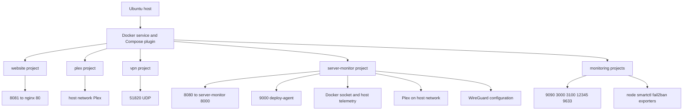
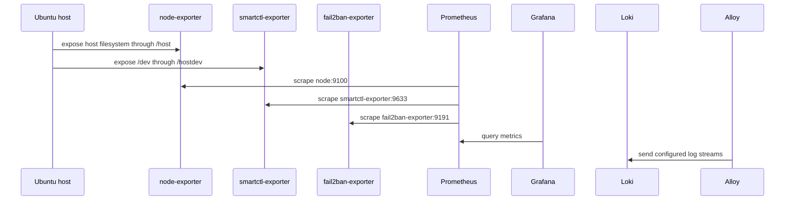

# HomeLab Architecture Overview

This repository describes one Ubuntu server managed as a Docker-based home lab. The Ansible install playbook installs Docker Engine and the Compose plugin, enables the Docker service, adds the `sparrow` account to the `docker` group, creates selected runtime directories, and starts each Compose project from its own directory. The repository is therefore organized around project boundaries rather than one root Compose application. [The provisioning and maintenance runbook](../operations/provisioning-and-maintenance.md) is the operational companion to this page.

## Runtime shape

The main boundaries are:

- **Application projects:** `website`, `plex`, and `vpn`.
- **Observability projects:** the separate Compose projects under `monitoring/` for Prometheus, Grafana, Loki, Alloy, and smartctl-exporter.
- **Host-management project:** `server-monitor`, which also builds and runs the `deploy-agent`.
- **Other projects:** the install/update playbooks additionally manage Syncthing, Portainer, Minecraft, Fail2ban, and the monitoring subprojects. They are part of the host lifecycle, although their Compose definitions are outside this overview's seed set.

*The diagram shows the repository's Compose projects, host-facing entrypoints, and the principal monitoring/control relationships.*

## Compose boundaries and traffic

Each project is started with `docker compose` in its own directory. Most services use their project-local default network, so a service name is not automatically a cross-project discovery mechanism. The monitoring services are the explicit exception: Prometheus, Grafana, Loki, Alloy, and smartctl-exporter all join an external Docker network named `monitoring`. Prometheus scrapes `node-exporter:9100`, `smartctl-exporter:9633`, and `fail2ban-exporter:9191` every 15 seconds; the latter exporter belongs to the separately managed Fail2ban project. The Compose files shown here do not create the external network, so it must exist before those projects can start successfully. See [Docker storage and networking](docker-storage-and-networking.md) for the focused networking and bind-mount reference.

The host-published entrypoints defined by the inspected Compose files are:

| Project or service | Host entrypoint | Role |
| --- | --- | --- |
| `website` / `web` | TCP `8081` → container `80` | Serves the repository's static `website/html` content through nginx. |
| `server-monitor` | TCP `8080` → container `8000` | Exposes the host monitoring/application service. |
| `deploy-agent` | TCP `9000` → container `9000` | Exposes the deployment helper used by `server-monitor`. |
| Prometheus | TCP `9090` → container `9090` | Metrics storage and query endpoint. |
| Grafana | TCP `3000` → container `3000` | Dashboard endpoint backed by its bind-mounted data. |
| Loki | TCP `3100` → container `3100` | Log-ingestion/query endpoint configured by the repository file. |
| Alloy | TCP `12345` → container `12345` | Alloy HTTP endpoint; its configuration is mounted read-only. |
| smartctl-exporter | TCP `9633` → container `9633` | SMART metrics endpoint scraped by Prometheus. |
| WireGuard | UDP `51820` → container `51820` | VPN server endpoint. |
| Plex | host network | Plex uses the host network rather than a Compose port mapping; the monitor is configured to reach host port `32400`. |

The `vpn` project combines DuckDNS and WireGuard. DuckDNS is configured for the `rusparrow` subdomain, while WireGuard uses `rusparrow.duckdns.org`, UDP `51820`, seven peers, and the `10.13.13.0/24` internal subnet. This page intentionally omits the DuckDNS token present in the Compose source; credentials must not be copied into documentation.

## Host integrations and control flow

`server-monitor` is deliberately more privileged than a typical application container. It has host PID visibility and read-only access to `/proc`, `/sys`, `/mnt/disk1`, and `/mnt/disk2`; it can inspect Docker through a read-only `/var/run/docker.sock`, read the system D-Bus socket, and inspect WireGuard through the read-only `/wireguard` mount and `/usr/bin/wg`. Its environment names the root block device as `sdc`, maps `sda` and `sdb` to the two storage mount points, and points its Plex client at `host.docker.internal:32400`.

`deploy-agent` is the write/control boundary. It mounts the complete `/home/sparrow/HomeLab` tree, the Docker socket read-write, and `/home/sparrow/.ssh` read-only. `server-monitor` addresses it as `http://deploy-agent:9000` within the `server-monitor` project network. Deployment status is persisted at `/home/sparrow/HomeLab/server-monitor/.deploy-status.json`. Treat changes to this container as host-administration changes, not ordinary application changes.

The observability flow is split into metrics and logs:

*The sequence shows the configured metrics scrape targets and the repository's separate log components; exact Alloy-to-Loki routing is owned by `monitoring/alloy/config.alloy`.*

## State and persistence

The repository uses bind mounts for state, making the host filesystem the durable owner across container recreation. Important locations include:

- Plex configuration: `/home/sparrow/HomeLab/plex/config/Application Support/Plex Media Server`; media is external at `/mnt/media`.
- Prometheus TSDB: `monitoring/prometheus/data` mounted at `/prometheus`.
- Grafana state: `monitoring/grafana/data` mounted at `/var/lib/grafana`.
- Loki state: `monitoring/loki/data` mounted at `/loki`; its configuration is read-only.
- Alloy state: `monitoring/alloy/data` mounted at `/var/lib/alloy/data`; its configuration is read-only.
- Website content: `website/html` mounted read-only into nginx.
- VPN state: `vpn/duckdns` and `vpn/wireguard`; WireGuard also reads `/lib/modules` and publishes generated configuration beneath its config tree.
- Server Monitor status: `.deploy-status.json` under the `server-monitor` project.

The install playbook creates the Plex, monitoring, VPN, and server-monitor runtime directories under `{{ homelab_path }}` with the `homelab_user` as owner. It does not create every bind-mounted path listed above (for example, the website content or media mount), so provisioning must ensure those source paths and the external `monitoring` network are available before startup. The Docker Compose `restart: unless-stopped` policy on these services provides restart-after-failure behavior while leaving an intentional administrative stop in place.

## Lifecycle and safe operations

Initial installation is ordered as host preparation, Docker installation, runtime-directory creation, and project startup. The install playbook starts ordinary projects with `docker compose up -d` and builds `server-monitor` with `docker compose up -d --build` because that project has local Dockerfiles.

Maintenance is a separate, repeatable lifecycle: `ansible/update-server.yml` loops over the complete project list, runs `docker compose pull`, then runs `docker compose up -d` for each project. It does not rebuild `server-monitor`; source or Dockerfile changes to that project require the install-style `--build` command (or an equivalent explicit rebuild). Because projects are independent, update order is project-list order rather than a single application transaction; a failed project update can leave other projects already recreated.

When extending the architecture:

1. Put service-local configuration and bind mounts in that service's Compose project.
2. Add a shared network only when a cross-project relationship is required, and document who creates it.
3. Add host paths to provisioning when they are required for a clean host, and keep durable data outside container layers.
4. Add the project to both install startup and update pull/recreate lists.
5. Minimize host privileges and avoid publishing an internal service unless its host entrypoint is intentional.

The most consequential failure boundaries are missing host paths, an absent external `monitoring` network, unavailable host devices or D-Bus, and stale images after an update. For diagnosis, first identify the owning project, then inspect its Compose configuration and bind-mounted host state; do not assume that restarting one project repairs another project's network or data state.
