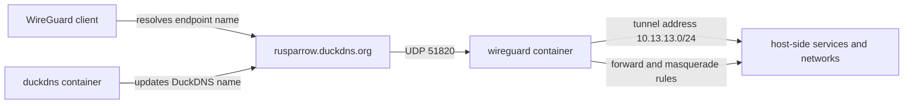

# Internet Exposure, DuckDNS, and WireGuard

The `vpn` Compose project has two complementary responsibilities:

- `duckdns` keeps the configured DuckDNS hostname associated with the Internet-facing address. It persists its application state under `vpn/duckdns` and is restarted unless stopped.
- `wireguard` is the VPN server. It uses the DuckDNS hostname as its advertised endpoint, listens on UDP port `51820`, and persists its generated configuration under `vpn/wireguard`.

The hostname is a rendezvous name, not a tunnel by itself. A remote client still needs the Internet path to reach UDP `51820`; the Compose file documents the container port publication (`51820:51820/udp`), while any upstream router or firewall forwarding is outside this repository's declared configuration.

## Connectivity and boundaries

This flow shows the configured client endpoint and the server's forwarding boundary; it does not imply that DuckDNS carries VPN traffic or that unconfigured peers exist.

The WireGuard server template assigns the server interface the `.1` address in the configured internal subnet and installs forwarding rules on interface-up. Its NAT rule masquerades traffic leaving through `eth+`; the corresponding rules are removed on interface-down. This is the mechanism that allows tunnel traffic to reach networks reachable from the WireGuard container, subject to the host and upstream network allowing that path.

The server and clients have deliberately different responsibilities:

- **Server side:** the container owns the listening interface, server key material, peer registry, and forwarding/NAT lifecycle. It requires `NET_ADMIN` and `SYS_MODULE`, and mounts `/lib/modules` so the image can manage the networking implementation.
- **Peer side:** each generated peer configuration contains a client address, client private material, the server's public identity, a per-peer preshared value, the DuckDNS endpoint, and allowed IPs. A peer initiates the tunnel to the server; it is not another server or a host service.

The Compose configuration requests seven peers (`PEERS=7`) on the `10.13.13.0/24` internal subnet and configures peer DNS as `8.8.8.8`. The generated peer files and keys are runtime/private material and must not be copied into documentation or committed as examples.

## Generated configuration and persistence

`./wireguard:/config` makes the repository's `vpn/wireguard` directory the WireGuard container's configuration root. The image-generated state is intentionally excluded by `.openwikiignore`, including:

- `vpn/wireguard/server/` for server-side key material and configuration state;
- `vpn/wireguard/peer*/` for generated peer state;
- `vpn/wireguard/wg_confs/` for rendered interface configuration, including the server interface file consumed by operational tooling.

The checked-in `vpn/wireguard/templates/server.conf` and `peer.conf` describe rendering behavior, not files to edit after generation. `.donoteditthisfile` records the generation inputs such as the endpoint, port, peer count, internal interface prefix, and allowed-IP policy; it contains no reason to expose generated secrets. Treat the generated directories as the source of operational state and back them up according to the recovery policy, while protecting their private contents.

The server template uses a private key from the server state directory and listens on `51820`. The peer template uses a peer-specific private key and preshared value and points back to the server's public identity at the DuckDNS endpoint. This establishes the server/peer boundary without requiring clients to know or share server private material.

## Host access and monitoring

WireGuard is a containerized network endpoint, not the host's general-purpose process namespace. The forwarding and masquerade rules in the server template govern traffic leaving the VPN interface; they do not automatically publish every Docker service or host daemon. Access to a particular host-side service still depends on its bind address, firewall, routing, and any container network boundary.

The server monitor has a separate, read-only observation path into this integration:

- It mounts the host's `vpn/wireguard` directory at `/wireguard:ro` and defaults to `/wireguard/wg_confs/wg0.conf` as its configuration path.
- It mounts `/var/run/docker.sock` read-only and uses the Docker API to find the `wireguard` container and run `wg show wg0 dump` inside it.
- It reports only peers with a handshake or traffic counters, labels them by observed index (`peer1`, `peer2`, and so on), and exposes endpoint, tunnel IP, handshake time, byte counters, and an online flag. A missing container, failed command, empty response, or other exception is represented as unavailable rather than treated as healthy.

Consequently, monitoring visibility is not proof of Internet reachability: the monitor can observe the local container through Docker, while a remote client additionally requires correct DNS resolution, UDP exposure, keys, routing, and a successful handshake. Conversely, a peer that has never connected is omitted from the monitor's active-peer list even though the server was configured to generate it.

## Operations and safe changes

- Keep the DuckDNS token, server and peer private keys, preshared values, and complete peer configuration contents out of the wiki, logs, tickets, and commits. The Compose file currently contains a credential in its environment declaration; handle it as secret operational data rather than reproducing it here.
- Change the endpoint, port, peer count, DNS, or subnet through the Compose configuration and regenerate/reconcile the image-managed state. Do not hand-edit generated peer or server files; inspect the rendered result without publishing secrets.
- When changing `SERVERPORT`, update the published UDP port and any upstream forwarding together. A DNS update alone cannot make a different UDP port reachable.
- Verify the local lifecycle with the Compose project, then use the server monitor to distinguish “container/config unavailable” from “container running with no recent peer handshakes.” Validate remote connectivity with a real peer rather than relying only on container status.
- Preserve the WireGuard generated state in backups. Restoring only Compose YAML without compatible server identity and peer state can invalidate existing clients; restoring private state requires the same care as restoring other credentials.

<!-- openwiki: broken internal link [../operations/backup-and-recovery.md] file "../operations/backup-and-recovery.md" does not exist. Fix the href or restore the target, then delete this comment. -->
The architecture and storage guidance in [Docker storage and networking](../architecture/docker-storage-and-networking.md), monitoring details in [Server monitor](server-monitor.md), and recovery procedures in [Backup and recovery](../operations/backup-and-recovery.md) provide the surrounding operational context.
