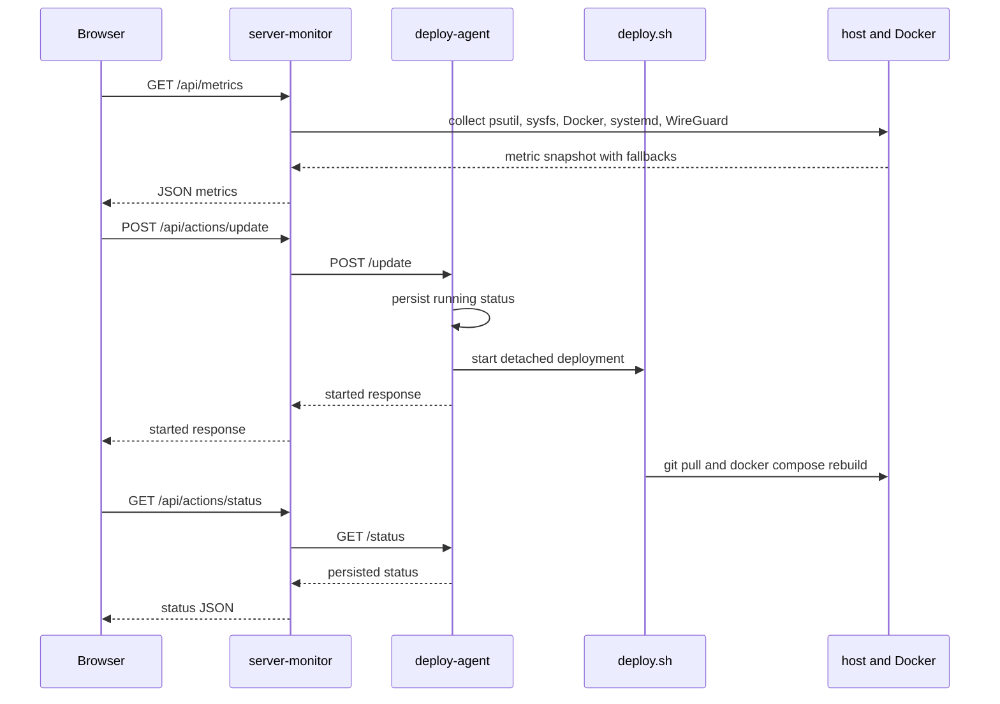
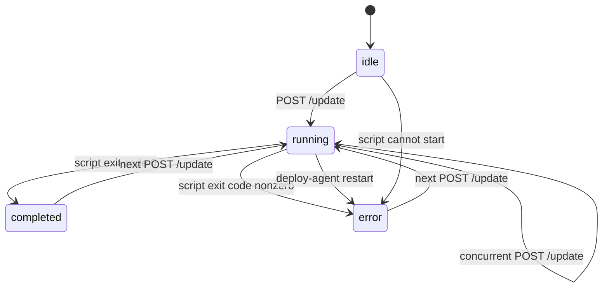

# Server Monitor and Deploy Agent

`server-monitor` is a host-observability UI and API, while `deploy-agent` is a deliberately separate update runner. The monitor container serves the browser, collects host and integration data, and proxies update requests; the agent owns the privileged deployment process and its persisted status.

## Runtime topology and request flow

The Compose application exposes `server-monitor` on host port `8080` and `deploy-agent` on `9000`. Inside the Compose network, the monitor calls the agent at `http://deploy-agent:9000`. The monitor is given read-only access to host observability surfaces: Docker’s socket, `/proc`, `/sys`, storage mounts, the system D-Bus socket, and the WireGuard tools/configuration. The deploy agent has the repository and Docker access needed by the deployment script; credentials and SSH material are intentionally not described here.



This sequence shows the browser-to-monitor-to-agent handoff and the asynchronous script boundary. The monitor does not run `deploy.sh` itself.

## Public FastAPI surface

The monitor application (`backend/app/main.py`) exposes:

- `GET /api/health` returns `{ "status": "ok" }`.
- `GET /api/metrics` returns the aggregate from `collect_all()`.
- `POST /api/actions/update` calls the agent’s `/update` endpoint with a five-second timeout and returns the agent JSON. A request failure or non-success response becomes HTTP `503` with `Сервис обновления недоступен`.
- `GET /api/actions/status` proxies the agent’s `/status` endpoint with the same five-second timeout and the same `503` behavior.
- `GET /` serves `frontend/index.html` when `FRONTEND_DIR` exists; otherwise it returns an API/docs hint. `GET /update-status` similarly serves `update-status.html`, with `Cache-Control: no-store`, or a fallback JSON message.
- `/static` is mounted to `FRONTEND_DIR` when that directory exists. CORS allows all origins, `GET` and `POST` methods, and all headers.

`FRONTEND_DIR` defaults to the repository’s `frontend` directory. `DEPLOY_AGENT_URL` defaults to `http://deploy-agent:9000`. These are monitor configuration, not browser-visible deployment credentials.

## Metrics contract and fallbacks

`GET /api/metrics` returns one snapshot containing `cpu`, `memory`, root `disk`, configured `storage_disks`, `uptime`, `temperature`, `docker`, `wireguard`, `plex`, `hostname`, and a Unix `timestamp`.

- **CPU and memory:** `psutil` supplies CPU percentage, logical core count, and a model string, plus memory totals, used/available bytes, and percentage. CPU model lookup reads `/proc/cpuinfo` and falls back to `CPU` if unavailable.
- **Storage:** root usage comes from `/`; `ROOT_BLOCK_DEVICE` defaults to `sdc`. Additional disks come from `STORAGE_DISKS`, defaulting to `sda:/mnt/disk1,sdb:/mnt/disk2`. Missing mounts and `disk_usage` errors are omitted; sysfs model/size failures fall back to the device name and a `null` nominal size. Sysfs size is converted from 512-byte sectors.
- **Uptime and temperature:** uptime uses `psutil.boot_time()`. Temperature reads `SYSFS_PATH/class/thermal` (default `SYSFS_PATH=/sys`), returns the hottest valid zone plus all valid zones, and returns `null` when the thermal tree or readings are unavailable.
- **Docker:** the collector pings Docker and lists all containers, sorted by name, including short ID, name, status, image, and creation time. If Docker is unavailable, it returns `available: false`, an error, and an empty list rather than failing the whole metrics request.
- **Plex:** the systemd probe checks `plexmediaserver` using `systemctl show`; an unavailable or missing systemd service yields `found: false` and `status: not_found`. When found, only an active/running service maps to `running`; other states map to `stopped`, with PID and service uptime where available. Independently, the web probe requests `/identity` at `PLEX_WEB_HOST` and `PLEX_WEB_PORT` (Compose sets `host.docker.internal` and `32400`). If HTTP fails, it falls back to a TCP connection and can report `note: tcp_ok`; otherwise web availability is false.
- **WireGuard:** the collector finds the `wireguard` Docker container and executes `wg show wg0 dump`. Missing container, command failure, empty output, or another exception produces `available: false`. Valid peers expose endpoint, IP, handshake, byte counters, and an online flag; peers with no handshake and no traffic are omitted.

Compose supplies the host integration settings and mounts needed for these probes. Changes to metric extensions should preserve the aggregate’s partial-failure pattern: optional integrations return their own unavailable/null result instead of taking down `/api/metrics`.

## Browser behavior

The dashboard (`/`) fetches `/api/metrics` immediately and every three seconds. It renders CPU, memory, root and configured storage disks, uptime, temperature, Plex, WireGuard peers, and Docker containers. A failed fetch changes the connection indicator to an error state but does not terminate polling. The update button posts to `/api/actions/update`; only a response whose `status` is `started` redirects to `/update-status`.

The status page polls `/api/actions/status` every three seconds with `cache: "no-store"`. `running` displays progress, `completed` redirects to `/`, and `error` stops the spinner, displays the persisted message, and reveals a link back to monitoring. A missing/idle status is treated as waiting; status-fetch errors are retried.

## Deploy-agent lifecycle and concurrency guard

The agent (`deploy-agent/app/main.py`) owns `DEPLOY_STATUS_FILE`, defaulting to `/home/sparrow/site/server-monitor/.deploy-status.json`; Compose sets it to `/home/sparrow/HomeLab/server-monitor/.deploy-status.json`. Reads return `{ "status": "idle" }` for a missing or invalid JSON file. Writes replace a temporary file atomically, and include an optional `message`.



The lifecycle is persisted in `.deploy-status.json`; the in-process `status_lock` serializes reads, writes, launch, and completion handling. A second update while status is `running` does not launch another process: it returns `status: started` with `Обновление уже запущено`. This response shape means the browser proceeds to the status page even when it joined an existing run. On startup, a previously persisted `running` status is converted to `error` because the prior process may have been interrupted by the agent restart.

`POST /update` writes `running`, starts `deploy.sh` with `start_new_session=True`, then returns immediately. An `OSError` while launching writes `error` and returns HTTP `500`. A daemon waiter observes the process exit: code `0` writes `completed`; any other code writes `error` with the exit code. The status endpoint returns the current JSON under the same lock.

## Deployment boundary and failure behavior

`deploy.sh` is the sole deployment command path. With `set -e`, it changes to `/home/sparrow/HomeLab`, marks that checkout safe for Git, runs `git pull`, changes to `/home/sparrow/HomeLab/server-monitor`, and runs:

```bash
docker compose up -d --build --no-deps server-monitor
```

Because `set -e` stops on a failed `git pull` or Compose command, the waiter records a non-zero exit as `error`; the current implementation does not expose command output, only the exit-code message. A successful update rebuilds and starts only `server-monitor` and does not directly recreate `deploy-agent`.

The Compose definition uses `restart: unless-stopped` for both services. The monitor has `pid: host`, maps host port `8080` to container port `8000`, and uses `extra_hosts` for `host.docker.internal`; the agent maps `9000:9000`. Keep the status-file path consistent between `DEPLOY_STATUS_FILE`, the mounted repository, and operational inspection. Atomic replacement prevents readers from observing a partially written status document, while the lock protects concurrent access within one agent process.

## Focused validation and safe changes

There are no repository tests under `server-monitor`; validation should therefore target the observable contracts rather than internal trivia:

1. Start the Compose stack and check `GET /api/health`, `GET /api/metrics`, `/`, and `/update-status`.
2. Exercise metrics with Docker unavailable, missing thermal zones, missing storage mounts, absent `systemctl`, absent Plex, and absent WireGuard; each optional integration should return its documented fallback while the aggregate remains available.
3. Verify Plex’s HTTP-success, HTTP-failure/TCP-success, and fully unavailable paths, and confirm WireGuard filters never-used peers.
4. Trigger two near-simultaneous `POST /api/actions/update` requests and verify only one deployment is launched and the second reports an already-running update.
5. Validate status transitions for successful completion, non-zero script exit, launch failure, and agent restart during `running`; inspect only the non-sensitive status fields.
6. Confirm the browser’s three-second metrics/status polling, no-store status fetch, completion redirect, and error recovery behavior.

When changing the monitor, preserve the proxy timeout and `503` boundary. When changing the agent, preserve atomic status writes, the lock around the running check and launch, and the startup conversion of stale `running` state to `error` unless the lifecycle contract is intentionally revised.
