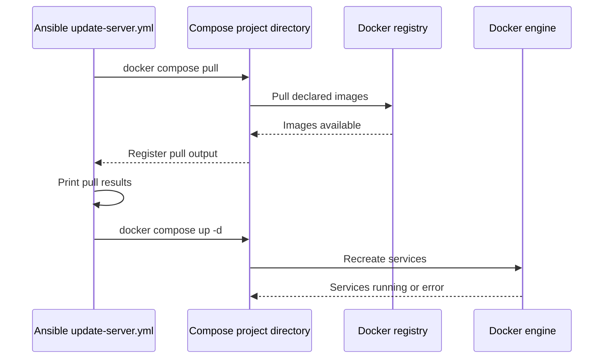

# Provisioning and Host Maintenance

This repository uses Ansible to prepare one Ubuntu host and then operate its Docker Compose projects. The playbooks target the `server` inventory group and run with privilege escalation. The checked-in inventory maps that group to the local machine:

```ini
[server]
localhost ansible_connection=local
```

That is a safe description of the repository default, not a guarantee that the target host is the intended production machine. Verify the inventory, Ubuntu release, CPU architecture, user account, mounted disks, and repository access before running a playbook. `ansible/ansible.cfg` selects `inventory.ini`, disables host-key checking, and fixes the Python interpreter to `/usr/bin/python3`.

## Provisioning control flow

The two installer files are related but are not interchangeable. The `.yml` playbook is the operational bootstrap for a checkout that already exists on the host. The `.ymlyy` file is a first-install variant that obtains the checkout, but stops after Docker is enabled.

<!-- openwiki: mermaid parse failed and this diagram was converted to a text fence so it does not break rendering. Fix the diagram source and restore the mermaid fence. Parser error: Heuristic: a semicolon inside a label breaks rendering; rephrase the label. -->
```text
flowchart TD
    A[Select installer variant] --> B{Checkout already exists}
    B -->|Yes| C[ansible/install-homelab.yml]
    B -->|No| D[ansible/install-homelab.ymlyy]
    C --> E[Update apt and install packages]
    E --> F[Configure Docker repository]
    F --> G[Install and start Docker]
    G --> H[Create runtime directories]
    H --> I[Start Compose projects in listed order]
    I --> J[Build and start server-monitor]
    D --> K[Update apt and install packages]
    K --> L[Configure Docker repository]
    L --> M[Clone main branch]
    M --> N[Add user to docker group]
    N --> O[Enable and start Docker]
    O --> P[Finish; no Compose startup]
```

*The diagram shows the distinct end states of the two installer variants; it does not imply that the clone variant creates application directories or starts services.*

### `ansible/install-homelab.yml`: configure and start an existing checkout

This playbook defines `homelab_user` as `sparrow`, but it does **not** define `homelab_path`. Supply or verify `homelab_path` through inventory, group/host variables, or the invocation before running it. It updates the apt cache (using a one-hour cache validity window), installs the base utilities and host tools, and configures Docker from Docker's Ubuntu apt repository using `/etc/apt/keyrings/docker.asc`.

The Docker installation includes `docker-ce`, `docker-ce-cli`, `containerd.io`, `docker-buildx-plugin`, and `docker-compose-plugin`. The playbook then enables and starts the `docker` systemd service and appends `homelab_user` to the `docker` group. A new login/session may be needed before that group membership is effective.

It creates the application-owned directories under `{{ homelab_path }}` with the HomeLab user's ownership and mode `0755`. The list covers Plex, monitoring data, Portainer, Syncthing, Minecraft, WireGuard/DuckDNS, and `server-monitor`. The parent project directories and their Compose files must already be present; this playbook does not clone or update the repository.

Compose startup is sequential because it is an Ansible loop. The exact order is:

1. `syncthing`
2. `website`
3. `plex`
4. `portainer`
5. `vpn`
6. `minecraft`
7. `fail2ban`
8. `monitoring/loki`
9. `monitoring/grafana`
10. `monitoring/smartctl-exporter`
11. `monitoring/alloy`
12. `monitoring/prometheus`

For each directory the task runs `docker compose up -d` with that directory as `chdir`. After the loop, `server-monitor` is handled separately with `docker compose up -d --build`, so its images are built as part of bootstrap. A failed task normally stops the play before later projects are attempted; inspect the failed directory and rerun after correcting it rather than assuming the whole stack started.

### `ansible/install-homelab.ymlyy`: clone-and-enable first install

The unusual filename is part of the repository and should be addressed exactly when selecting the file. This variant defines `homelab_user: sparrow`, `homelab_repo: "git@github.com:RUSparrow/site.git"`, and `homelab_path: "/home/{{ homelab_user }}/HomeLab"`. It creates `/home/{{ homelab_user }}`, clones the `main` branch there as the non-root user, adds that user to the `docker` group, and enables/starts Docker.

It does not create the runtime directories, run `docker compose`, or build `server-monitor`. It also hard-codes the Docker repository architecture to `amd64`, while the other installer derives architecture from `ansible_facts['architecture']`. Verify that the target is compatible before using this variant. The SSH-based clone also requires repository access to be configured for the target user; do not put credentials or private keys in this page or in inventory.

The two files also differ in Docker repository suite handling: the clone variant uses `ansible_distribution_release`, while the existing-checkout variant uses `ansible_facts['distribution_release']`. Both require a supported Ubuntu release and access to `https://download.docker.com/linux/ubuntu/gpg` and the Docker apt repository.

## Maintenance updates

`ansible/update-server.yml` is the recurring image-refresh path. It targets the same `server` group with privilege escalation and contains an explicit list of Compose project paths rooted at `/home/sparrow/HomeLab`. That list includes the same application projects as bootstrap, with `server-monitor` placed before the monitoring projects.

For each project it runs `docker compose pull`. The results are registered and printed with an Ansible debug task; the pull task is marked `changed_when: false`, so its status is informational rather than a change report. It then runs `docker compose up -d` once per project, in list order, to recreate services with the pulled images. This playbook does not build `server-monitor`, clone the repository, update apt, or install Docker. Verify that its hard-coded root path matches the actual `homelab_path` before use.



*The maintenance sequence repeats for each project in `compose_projects`; it is not a single cross-project Compose application.*

## Operational invariants and checks

- **Variables are prerequisites.** The existing-checkout installer cannot resolve `{{ homelab_path }}` from its own `vars` block. Supply it and confirm that every listed directory contains the expected Compose configuration. The update playbook independently assumes `/home/sparrow/HomeLab`.
- **The inventory is local by default.** `localhost ansible_connection=local` means the default run acts on the machine where Ansible is invoked. Replace or override the inventory deliberately for a remote Ubuntu host; verify privilege escalation and Python availability.
- **Docker must be usable before Compose starts.** The bootstrap installs the Compose plugin, starts Docker, and grants group membership, but an already-open shell may not see the new group. Check `docker compose` as the intended user before diagnosing project failures.
- **Host mounts are environmental contracts.** Some Compose definitions bind host resources such as `/var/run/docker.sock`, `/proc`, `/sys`, disk mount points, and WireGuard paths. In particular, `server-monitor` expects `/mnt/disk1`, `/mnt/disk2`, and `/home/sparrow/HomeLab`-style paths. Confirm those mounts and paths on the target rather than inventing replacements.
- **Startup order is orchestration order, not readiness.** `docker compose up -d` returns after services are launched according to each project's Compose behavior; the Ansible loop does not add health checks or wait for one project to become healthy before starting the next.
- **Repeatability has limits.** Package, directory, Docker repository, systemd, user-group, and git tasks are designed to converge, while Compose commands are imperative reconciliation steps. Review command output and service status after partial failures.

<!-- openwiki: broken internal link [backup-and-recovery.md] file "backup-and-recovery.md" does not exist. Fix the href or restore the target, then delete this comment. -->
For application-specific persistence and recovery procedures, see [Backup and Recovery](backup-and-recovery.md). For deployment/update workflow context, see [Deploy and Update](../workflows/deploy-and-update.md), and use [Validation](../testing/validation.md) for focused post-change checks. The architecture context is in [Architecture Overview](../architecture/overview.md).

## Source entrypoints

The authoritative entrypoints are `ansible/ansible.cfg`, `ansible/inventory.ini`, `ansible/install-homelab.yml`, `ansible/install-homelab.ymlyy`, and `ansible/update-server.yml`. Treat the playbooks as the source of truth for project order, path assumptions, package lists, and variant boundaries; update this page when those operational contracts change.
