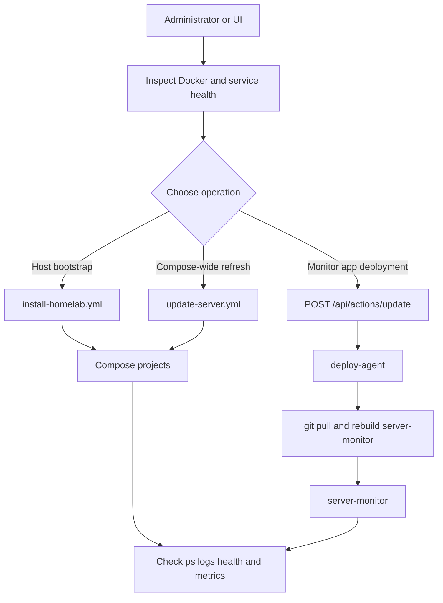

# HomeLab Quickstart

This repository describes an Ubuntu host running several independent Docker Compose projects under `/home/sparrow/HomeLab`. Start with read-only inspection, then choose the narrowest operation that matches the task. Do not copy sensitive runtime files into documentation or commits; `.openwikiignore` deliberately excludes VPN material, Plex and Syncthing runtime data, Minecraft credentials and runtime state, and monitoring data.

## Choose the right route

| Need | Start here | Then consult |
|---|---|---|
| Understand project boundaries, ports, mounts, and shared networks | [Architecture overview](/openwiki/architecture/overview.md) | [Docker, storage, and networking](/openwiki/architecture/docker-storage-and-networking.md) |
| Bootstrap or repair the Ubuntu/Docker host | [Provisioning and host maintenance](/openwiki/operations/provisioning-and-maintenance.md) | [Validation and safe change checks](/openwiki/testing/validation.md) |
<!-- openwiki: broken internal link [/openwiki/operations/backup-and-recovery.md] file "/openwiki/operations/backup-and-recovery.md" does not exist. Fix the href or restore the target, then delete this comment. -->
| Update all Compose projects | [Provision, deploy, update, and troubleshoot](/openwiki/workflows/deploy-and-update.md) | [Persistent data, backups, and recovery](/openwiki/operations/backup-and-recovery.md) |
| Investigate metrics, logs, disks, or exporters | [Metrics, logs, and monitoring stack](/openwiki/services/monitoring.md) | [Server Monitor and Deploy Agent](/openwiki/integrations/server-monitor.md) |
<!-- openwiki: broken internal link [/openwiki/operations/backup-and-recovery.md] file "/openwiki/operations/backup-and-recovery.md" does not exist. Fix the href or restore the target, then delete this comment. -->
| Operate Plex or Minecraft | [Plex and Minecraft services](/openwiki/services/media-and-games.md) | [Persistent data, backups, and recovery](/openwiki/operations/backup-and-recovery.md) |
| Operate VPN, website, sync, Portainer, or Fail2ban | [Internet exposure, DuckDNS, and WireGuard](/openwiki/integrations/networking-and-vpn.md) and [Website, Syncthing, Portainer, and Fail2ban](/openwiki/services/web-and-sync.md) | [Docker, storage, and networking](/openwiki/architecture/docker-storage-and-networking.md) |

## Host and Docker prerequisites

The Ansible inventory targets the local machine (`localhost ansible_connection=local`) and uses `/usr/bin/python3`. The bootstrap playbook runs with privilege escalation, installs Python and host tools including `git`, `smartmontools`, and `fail2ban`, installs Docker Engine plus the Compose plugin from Docker's Ubuntu repository, enables and starts Docker, and adds `sparrow` to the `docker` group. A new group membership may require a new login session before an unprivileged shell can run Docker commands.

The playbook expects `homelab_path` to be supplied and creates service data directories beneath it. The repository's normal path is `/home/sparrow/HomeLab`; verify the mount and ownership before using another path. From the repository's `ansible` directory, a local bootstrap is therefore shaped like:

```bash
cd ansible
ansible-playbook -i inventory.ini install-homelab.yml -e homelab_path=/home/sparrow/HomeLab
```

The bootstrap starts the standalone projects in a deliberate sequence and finally builds `server-monitor` with `docker compose up -d --build`. It is not a substitute for checking host mounts, available disk space, or external media paths first. See [Provisioning and host maintenance](/openwiki/operations/provisioning-and-maintenance.md) for the playbook boundary and assumptions.

## Safe inspection first

Run these commands from the relevant project directory or use an absolute path. They inspect configuration and state without changing application data:

```bash
cd /home/sparrow/HomeLab
sudo systemctl status docker
find . -name docker-compose.yml -print
for project in syncthing website plex portainer vpn minecraft fail2ban server-monitor monitoring/loki monitoring/grafana monitoring/smartctl-exporter monitoring/alloy monitoring/prometheus; do
  docker compose -f "$project/docker-compose.yml" config --quiet || exit 1
done
docker compose -f server-monitor/docker-compose.yml ps
docker ps --format 'table {{.Names}}\t{{.Status}}\t{{.Ports}}'
```

`docker compose config --quiet` catches interpolation and Compose syntax problems without starting services. Then inspect only the affected project with `docker compose ps`, `docker compose logs --tail=100 SERVICE`, and `docker compose config`. Avoid publishing command output that could contain environment values or runtime credentials. For host-level failures, check `systemctl status docker`, `journalctl -u docker`, `df -h`, and the availability of `/mnt/disk1` and `/mnt/disk2` before restarting containers.

The `server-monitor` project is a useful first health check: it publishes the UI/API on host port `8080` and deploy-agent on `9000`. Its health endpoint is:

```bash
curl -fsS http://127.0.0.1:8080/api/health
curl -fsS http://127.0.0.1:8080/api/metrics
```

The monitor reads host and Docker resources through read-only mounts, so failures in `/proc`, `/sys`, Docker socket access, DBus, WireGuard tooling, or the configured storage disks can explain incomplete metrics. Follow [Server Monitor and Deploy Agent](/openwiki/integrations/server-monitor.md) rather than granting additional access by default.

## Routine updates

The supported batch update is `ansible/update-server.yml`. It loops over the Compose projects, runs `docker compose pull` in each project, prints pull results, and then runs `docker compose up -d` to recreate services as needed. From `ansible`:

```bash
ansible-playbook -i inventory.ini update-server.yml
```

Review the pull output and service state after the run. This update path does not perform a repository `git pull`, does not rebuild every image, and does not back up application data; use the workflow and recovery pages before changing stateful services.

The Server Monitor UI/API also exposes `POST /api/actions/update`. That request is handed to the internal `deploy-agent`, which serializes concurrent requests with a lock, records status in `server-monitor/.deploy-status.json`, runs `server-monitor/deploy-agent/scripts/deploy.sh` asynchronously, and reports `running`, `completed`, or `error`. The script performs `git pull` and rebuilds only the `server-monitor` service with `--no-deps`. Treat it as a targeted application deployment, not as a replacement for the Ansible Compose-wide update.



This diagram shows the three operational paths and their shared verification point.

## Troubleshooting order

1. **Host:** confirm the machine is Ubuntu-compatible for the playbook, Docker is enabled, the executing user has the expected group membership, and `/home/sparrow/HomeLab` plus `/mnt/disk1` and `/mnt/disk2` exist.
2. **Compose definition:** run `docker compose config --quiet` in the failing project; check image pulls, bind-mount paths, port collisions, and network declarations.
3. **Container lifecycle:** run `docker compose ps` and targeted logs. Recreate only the affected project unless the dependency relationship requires more.
<!-- openwiki: broken internal link [/openwiki/operations/backup-and-recovery.md] file "/openwiki/operations/backup-and-recovery.md" does not exist. Fix the href or restore the target, then delete this comment. -->
4. **Data safety:** do not delete named volumes, bind-mounted data, Minecraft worlds, Plex config, Syncthing config, WireGuard directories, or monitoring data while troubleshooting. Consult [Persistent data, backups, and recovery](/openwiki/operations/backup-and-recovery.md).
5. **Application checks:** use `/api/health`, `/api/metrics`, and `/api/actions/status` for server-monitor; inspect exporter targets and dashboards through [Metrics, logs, and monitoring stack](/openwiki/services/monitoring.md).
6. **Validation:** after a change, validate Compose files, Ansible syntax, mount availability, service recovery, and the relevant endpoint. The repository has no broad focused automated test suite, so these operational checks are important; see [Validation and safe change checks](/openwiki/testing/validation.md).

Never “fix” a failed update by exposing credentials, printing private configuration, or replacing a persistent directory. Capture the failing service name, command, exit status, and non-sensitive log context, then use the domain page that owns that boundary.
