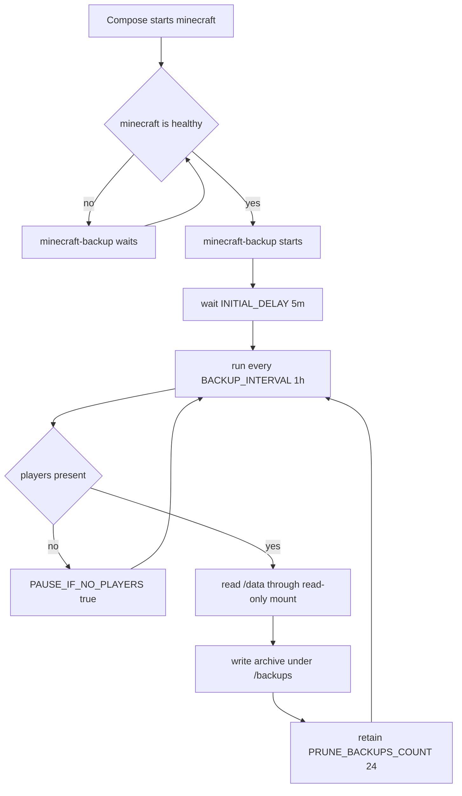

# Plex and Minecraft Services

This host runs Plex and Minecraft as separate Docker Compose projects. The Ansible bootstrap creates the service directories and starts both projects, but the application data remains owned by the bind-mounted host paths. Treat those paths as persistent state: changing or deleting containers is not equivalent to deleting the data, while changing mount paths can make an otherwise healthy container appear empty.

## Plex

The Plex project defines one container:

- Image: `lscr.io/linuxserver/plex:latest`
- Container name: `plex`
- Networking: `network_mode: host`
- Restart policy: `unless-stopped`
- Environment: `PUID=1000`, `PGID=1000`, `TZ=Europe/Tallinn`, and `VERSION=docker`

Host networking means Plex is not given a Compose port-publishing rule. It binds directly on the host network; the service monitor checks the Plex HTTP endpoint at `http://127.0.0.1:32400/identity` by default, with `PLEX_WEB_HOST` and `PLEX_WEB_PORT` available to change that probe. The monitor first tries HTTP with a three-second timeout and falls back to a TCP connection when HTTP fails because of redirect or TLS behavior. A successful TCP fallback is reported as available but has no HTTP status code.

The two Plex mounts define distinct ownership boundaries:

| Host path | Container path | Purpose |
| --- | --- | --- |
| `/home/sparrow/HomeLab/plex/config/Application Support/Plex Media Server` | `/config` | Plex server configuration, library metadata, and application state |
| `/mnt/media` | `/media` | Media files presented to Plex |

The Ansible playbook creates the parent Plex runtime directories under `{{ homelab_path }}/plex/config`, `{{ homelab_path }}/plex/transcode`, and `{{ homelab_path }}/plex/cache`, but the Compose file currently mounts the explicit configuration path above and does not mount `transcode` or `cache`. Do not infer that those two created directories are active Plex mounts. Verify the effective Compose configuration and host paths before relocating data.

### Plex monitoring boundary

`server-monitor` reports two complementary signals. It enumerates Docker containers through the Docker API, while `get_plex_status()` also probes a host service named `plexmediaserver.service` through `systemctl` when `systemctl` is available. The systemd result is mapped to `running` only when `ActiveState=active` and `SubState=running`; otherwise it is `stopped`. If the unit is absent, the result is `found: false`, but the web probe is still returned. Therefore a container named `plex` and the systemd service check are not interchangeable: use the container state and Plex web probe when operating this Compose deployment, and interpret a missing systemd unit as a monitoring integration boundary rather than proof that the container is down.

## Minecraft runtime

The Minecraft project runs:

- Image: `itzg/minecraft-server:latest`
- Container name: `minecraft`
- Published port: `55555:25565` (host port `55555` reaches the container's Minecraft port `25565`)
- Restart policy: `unless-stopped`
- Interactive terminal: `tty: true` and `stdin_open: true`

Its runtime contract is set by these environment keys:

```yaml
EULA: "TRUE"
TYPE: "FORGE"
VERSION: "1.20.1"
MEMORY: "4G"
ONLINE_MODE: "FALSE"
```

The only Minecraft data mount is `./data:/data`. In the Compose project directory this is the host's Minecraft data directory, including the world and Forge/server state. `ONLINE_MODE: "FALSE"` disables normal account authentication; treat the published port as an intentionally exposed unauthenticated game boundary and control reachability with the host network policy or VPN rather than assuming account verification protects it.

## Backup dependency and retention

`minecraft-backup` uses `itzg/mc-backup:latest` with container name `minecraft-backup`. It depends on `minecraft` with `condition: service_healthy`, so Compose must consider the Minecraft service healthy before creating the backup service. The backup container shares the server data read-only (`./data:/data:ro`) and writes archives to `./backups:/backups`; this prevents the backup service from modifying live server files through its mount. It addresses the server as `RCON_HOST: minecraft` on the Compose network.

The configured lifecycle is:



Caption: Minecraft readiness gates the backup service, which periodically reads live data and prunes its backup directory.

The operational settings are `BACKUP_INTERVAL: "1h"`, `INITIAL_DELAY: "5m"`, `PAUSE_IF_NO_PLAYERS: "true"`, and `PRUNE_BACKUPS_COUNT: "24"`. In the configured steady state, backups are attempted hourly after the initial five-minute delay, are skipped or paused when no players are present according to the backup image behavior, and the backup process retains 24 backups. Retention is count-based, not a promise of a particular number of days: actual coverage depends on successful runs and whether player activity causes pauses. `restart: unless-stopped` applies to both the game and backup containers, but it does not replace checking that `/backups` contains recent archives.

## Lifecycle and operations

The Ansible installation creates `{{ homelab_path }}/minecraft/data` and `{{ homelab_path }}/minecraft/backups` as host directories, then starts the Minecraft project with `docker compose up -d` from `{{ homelab_path }}/minecraft`. It also creates Plex's runtime directories and starts that project with the same command from `{{ homelab_path }}/plex`. These are deployment entrypoints, not data migration procedures.

For a controlled change, inspect the Compose file and the effective host paths first, stop or recreate only the affected project, and verify both container status and mounted paths afterward. Preserve the container names, image names, environment-key names, ports, and mount paths unless the change explicitly includes clients, firewall rules, monitoring, and recovery documentation. Never put credentials, RCON secrets, Plex tokens, or private runtime contents in this page.

### Safe boundaries and failure modes

- **Do not edit live state through the backup mount.** `/data` is intentionally `ro` in `minecraft-backup`; restore work must be a deliberate server maintenance operation, not an edit inside the backup container.
- **Backups are local copies, not disaster recovery.** `./backups` is a host bind mount on the same machine. Disk loss, filesystem damage, or an incorrect host path can affect both the live data and its backups; use the recovery process and an independent destination for stronger protection.
- **Do not confuse an empty application with lost data.** A changed `./data` working directory or changed Plex `/config` host path starts against a different directory. Confirm the Compose project directory and bind mounts before initializing a replacement container.
- **Forge and image upgrades are stateful.** `VERSION: "1.20.1"`, Forge content, world data, and mods must remain compatible. Back up and test a copy before changing the image tag, Minecraft version, or server contents.
- **Health dependency is a startup gate, not backup validation.** A healthy Minecraft container does not prove that an archive was created, that `/backups` is writable, or that retention completed. Check recent backup artifacts and available disk space separately.

## Focused verification

After deployment or a change, verify the high-value boundaries rather than relying only on `restart: unless-stopped`:

1. Confirm `minecraft` and `minecraft-backup` are running and that `minecraft-backup` reached its dependency-gated startup.
2. Confirm host port `55555` reaches the Minecraft service and that the server is using Forge `1.20.1` with the intended `MEMORY` setting.
3. Confirm the Minecraft world is present under the host `data` directory and that new backup artifacts appear under the host `backups` directory.
4. Confirm no more than the configured 24 backups are retained after a successful prune cycle.
5. Confirm Plex is reachable at port `32400` on the host network and that the `/config` and `/media` mounts resolve to the intended host paths.
6. In server-monitor, distinguish Docker container inventory from the optional `plexmediaserver.service` systemd result; a missing systemd unit does not by itself diagnose the Compose container.
