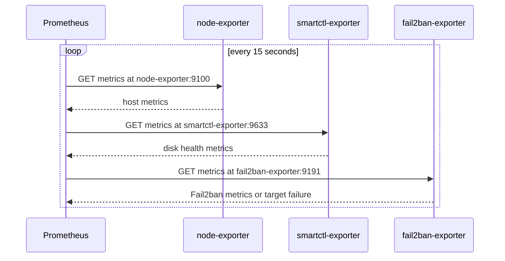
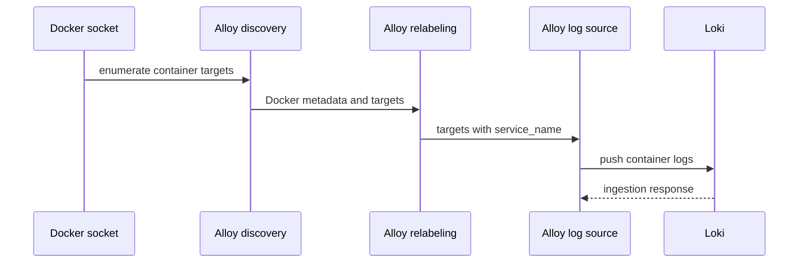

# Metrics, Logs, and Monitoring Stack

This repository separates metrics collection from container-log collection. Prometheus polls exporter HTTP endpoints every 15 seconds; Alloy watches the Docker API and forwards discovered container logs to Loki; Grafana is the HTTP-accessible visualization and exploration service. The components communicate by Docker service name on a shared, externally managed network named `monitoring`.

## Topology and data paths

### Prometheus metrics path

Prometheus is configured with three static scrape jobs:

- `node` scrapes `node-exporter:9100` for host metrics.
- `smartctl` scrapes `smartctl-exporter:9633` for disk health metrics.
- `fail2ban` scrapes `fail2ban-exporter:9191` for Fail2ban metrics.

The scrape interval is 15 seconds. The first two targets are attached to the external `monitoring` network by their Compose files. The Fail2ban Compose file publishes port `9191` but does not declare that external network, so its service-name target is an integration dependency that must be checked in the deployed Docker topology; as written, the separately started Fail2ban project uses its own default Compose network.

*The diagram shows Prometheus's configured scrape sequence and the three exporter boundaries.*

`node-exporter` is given a read-only, propagated mount of the host root at `/host` and uses `--path.rootfs=/host`, so its measurements represent the Docker host rather than only the container. `smartctl-exporter` runs as root with `privileged: true`, mounts host `/dev` at `/hostdev`, and disables power-mode checks with `--smartctl.powermode-check=never`. These permissions are deliberate operational boundaries: changing the mounts or privilege can make collection incomplete or fail, while retaining them gives the exporters broad host observation access.

Prometheus stores its TSDB at `/prometheus`, backed by `monitoring/prometheus/data`, and reads `monitoring/prometheus/prometheus.yml` read-only. Its container publishes port `9090`; the published port is for host access and is separate from internal Docker DNS names used by the scrape targets.

### Alloy-to-Loki log path

Alloy uses two views of the Docker socket. `discovery.docker "containers"` discovers container targets through `unix:///var/run/docker.sock`; `discovery.relabel "containers"` copies the Docker container name metadata into a `service_name` label after removing the leading slash. `loki.source.docker "containers"` reads the discovered container logs and forwards them to `loki.write "default"`. The writer pushes to `http://loki:3100/loki/api/v1/push`.

*The diagram shows Docker discovery, label enrichment, log ingestion, and the Loki push boundary.*

Alloy mounts the Docker socket read-only, the Alloy configuration read-only at `/etc/alloy/config.alloy`, and persistent state at `/var/lib/alloy/data` backed by `monitoring/alloy/data`. It exposes its HTTP server on port `12345` and runs the configured file with `--storage.path=/var/lib/alloy/data`. Loss of socket access prevents discovery and collection; loss of the Loki route prevents forwarding even if discovery remains healthy.

Loki listens on HTTP port `3100` and receives the push API request above. It uses single-process filesystem storage: the TSDB schema is v13, chunks are stored under `/loki/chunks`, and the entire `/loki` tree is persisted by `monitoring/loki/data`. Retention is configured for 30 days and enabled through the compactor, with filesystem-backed delete requests. Loki authentication is disabled in the supplied configuration, so the published port and network exposure should be treated as an access-control boundary. Loki also enables structured metadata and volume reporting, and exposes a local ruler configuration with an `alertmanager_url` pointing at `http://alertmanager:9093`; no Alertmanager service is declared in these monitoring Compose files.

Grafana is attached to `monitoring`, persists `/var/lib/grafana` in `monitoring/grafana/data`, and publishes port `3000`. The repository declares no Grafana datasource provisioning, dashboards, or alert rules, so connecting Grafana to Prometheus and Loki is an operational/application configuration step rather than an automatically provisioned relationship in these files.

## Shared network and lifecycle assumptions

Alloy, Grafana, Loki, Prometheus, node-exporter, and smartctl-exporter declare the same `monitoring` network with `external: true`. Docker Compose therefore does not create or own that network; it must already exist before these projects are started. The network is the basis for names such as `loki`, `node-exporter`, and `smartctl-exporter`. Removing it, renaming it, or omitting a service attachment breaks internal reachability even when the corresponding host-published port still responds.

The Fail2ban project is different: its Compose file defines only the exporter service, its bind mount of `/var/run/fail2ban` read-only, host port `9191`, and restart policy. It has no `networks` declaration. Prometheus's `fail2ban-exporter:9191` target therefore requires an explicit shared-network attachment or another deployment adjustment. A healthy container and an open host port do not by themselves prove that Prometheus can resolve or scrape the target over `monitoring`.

The persistent data directories are bind mounts, not named volumes. Preserve them during upgrades or recovery: Prometheus data contains the metrics TSDB, Loki data contains chunks/indexes/compactor state/rules, Grafana data contains its application state, and Alloy data contains its runtime state. The configuration files are mounted read-only, so configuration changes require updating the source file and recreating or reloading the relevant service according to the image's supported behavior.

## Operational failure signals

Use the following symptoms to narrow an incident:

- **A Prometheus target is down:** check container state and service-name reachability on `monitoring`, then verify the exporter endpoint and its host mount/device prerequisites. For Fail2ban, inspect network attachment first because its Compose project does not declare `monitoring`.
- **Node metrics are missing or unexpectedly container-scoped:** verify `/host` and `--path.rootfs=/host` on node-exporter.
- **SMART metrics are absent:** verify privileged execution, host `/dev` visibility, and the exporter command; disk inspection cannot work reliably without the expected device boundary.
- **Container logs do not appear in Loki:** check Alloy's read-only Docker socket, its discovered targets and `service_name` labels, and reachability of `loki:3100` on `monitoring`. A running application container is not sufficient if Alloy cannot discover it or Loki cannot receive the push.
- **Grafana cannot explore data:** check that Grafana can reach Prometheus and Loki on the shared network and that datasources have been configured; neither is provisioned by this repository.
- **Logs disappear sooner than expected or Loki fills its data directory:** check the 30-day retention/compactor configuration, filesystem capacity, and the `monitoring/loki/data` bind mount. Retention is not a substitute for backing up or sizing the host filesystem.
- **All monitoring projects fail to start:** verify that the external Docker network named `monitoring` exists before starting the Compose projects.

## Safe change and validation points

The primary change points are `monitoring/prometheus/prometheus.yml` for scrape jobs and interval, `monitoring/alloy/config.alloy` for Docker discovery, labels, and Loki forwarding, and `monitoring/loki/config/config.yml` for storage, retention, and ruler behavior. The Compose files own image selection, ports, mounts, restart policy, privilege, and network attachment.

Before deploying a monitoring change, validate each Compose project and confirm the external network exists. After deployment, check that Prometheus sees all three configured jobs as reachable, Alloy can enumerate containers and forward a representative container log, Loki accepts the push endpoint, and Grafana can reach the intended Prometheus and Loki endpoints. Treat Docker-socket access, privileged `/dev` access, host-root inspection, published ports, and Loki's `auth_enabled: false` as security-sensitive boundaries when reviewing changes.

## Source entrypoints

- `monitoring/prometheus/prometheus.yml` — scrape interval and exporter targets.
- `monitoring/prometheus/docker-compose.yml` — Prometheus persistence/network and node-exporter host view.
- `monitoring/smartctl-exporter/docker-compose.yml` — privileged disk-health exporter boundary.
- `fail2ban/docker-compose.yml` — Fail2ban exporter endpoint and its separate network declaration.
- `monitoring/alloy/config.alloy` and `monitoring/alloy/docker-compose.yml` — Docker discovery, relabeling, Loki push, and socket/state mounts.
- `monitoring/loki/config/config.yml` and `monitoring/loki/docker-compose.yml` — Loki API, filesystem storage, retention, and persistence.
- `monitoring/grafana/docker-compose.yml` — Grafana network, port, and persistent state.
- `ansible/install-homelab.yml` — provisioning of monitoring data directories and Compose startup order.
