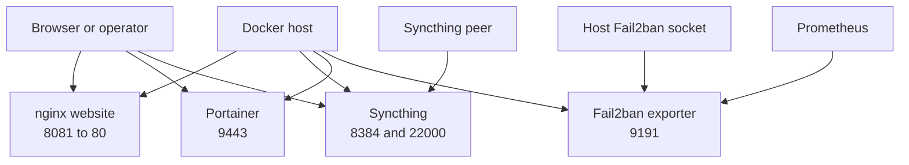

# Website, Syncthing, Portainer, and Fail2ban Services

These four Compose projects are small, independently started services. Each uses a `latest` image and `restart: unless-stopped`; they do not share a Compose network declaration. Start them from their own project directories, and verify any cross-project integration separately. The deployment playbook starts Syncthing, website, Portainer, and Fail2ban as separate Compose projects after creating selected runtime directories.

## Service topology



*The diagram shows the host-published entrypoints and the host or peer boundaries each service depends on.*

## Website: nginx static content

`website/docker-compose.yml` runs `nginx:latest` as container `website` and publishes host port `8081` to container port `80`. It mounts `./html` into `/usr/share/nginx/html` read-only, so nginx serves the contents of the project-local `html` directory and cannot write the served tree. The container is therefore a static HTTP endpoint rather than an application server.

There is an important repository consistency issue to verify before deployment: the repository contains `website/index.html`, `website/css/style.css`, and `website/js/main.js`, but no `website/html/` directory. The Compose mount expects `website/html/index.html` and corresponding `html/css` and `html/js` paths. Do not silently infer that the root-level files are served. Check the deployed checkout and either verify that a packaging/sync step creates `html/`, or treat the website as incomplete until the source layout and mount agree.

The checked-in page is a Russian-language personal landing page with About, Skills, and Contact sections. Its stylesheet and JavaScript are referenced by relative URLs (`css/style.css` and `js/main.js`), so those assets must be below the directory actually mounted as nginx's document root. The JavaScript adds the mobile menu, scroll effects, client-side validation, and a success toast; submitting the contact form is prevented in the browser and does not call a mail or HTTP backend. A successful toast is not evidence that a message was delivered.

**Website verification:** from `website/`, inspect the expected content root and render the page through `http://HOST:8081/` after starting the project. Check the browser network panel for `css/style.css` and `js/main.js`, and confirm the container's `/usr/share/nginx/html/index.html` is the intended file. This specifically catches the root-versus-`html` mismatch.

## Syncthing: synchronized data and UI

The Syncthing project runs `syncthing/syncthing:latest` as `syncthing` with hostname `home-server`. It sets `PUID=1000` and `PGID=1000`, then mounts:

- `./data` to `/var/syncthing`, the container's Syncthing state/configuration area.
- `/home/sparrow/HomeLab` to `/sync/HomeLab`, the host content exposed for synchronization.

The published ports have distinct roles: `8384` is the Syncthing web UI, `22000/tcp` and `22000/udp` support device synchronization, and `21027/udp` supports local discovery. The host path is an explicit deployment assumption, not a portable relative path; verify that it exists and contains the intended data before starting the service. The Compose file's `./data` bind mount is the persistence boundary for the service state. The provisioning playbook creates `syncthing/data` and also creates `syncthing/config`, but this Compose file does not mount `./config`; treat that extra directory as unused unless another deployment step supplies a configuration path.

Syncthing changes are operationally stateful: preserve `syncthing/data` when recreating or upgrading the container, and do not treat `/sync/HomeLab` as disposable container storage. After startup, verify the UI on port `8384`, the configured folder path, permissions for UID/GID `1000`, and connectivity to a representative peer over the required TCP/UDP ports.

## Portainer: Docker control plane

Portainer runs `portainer/portainer-ce:latest` as `portainer` and publishes HTTPS/UI port `9443`. It mounts `/var/run/docker.sock` read-write at the same path and persists Portainer application data in `./data:/data`.

The Docker socket is a high-impact control boundary: it gives Portainer access to the Docker daemon, so access to the Portainer endpoint must be restricted to trusted operators and networks. The socket is not read-only in this Compose file. Preserve `portainer/data` across container replacement; losing it loses Portainer's persisted application state. Validate the HTTPS endpoint and that Portainer can enumerate the intended Docker resources, while treating socket exposure and the published port as security-sensitive configuration.

## Fail2ban exporter: monitoring adapter

The Fail2ban project runs `registry.gitlab.com/hctrdev/fail2ban-prometheus-exporter:latest` as `fail2ban-exporter` and publishes metrics on `9191`. It mounts `/var/run/fail2ban` into the container read-only, allowing the exporter to observe the host Fail2ban control socket without granting write access through that mount. The service has no persistent data mount.

Prometheus is configured to scrape `fail2ban-exporter:9191`, but this Compose file declares no `monitoring` network. Since a separately started Compose project normally receives its own default network, the container can be running and host port `9191` can be reachable while Prometheus still cannot resolve the service name on its monitoring network. Verify the deployed network attachment and scrape target explicitly; do not interpret an open host port alone as successful monitoring integration. Also verify that the host Fail2ban socket exists and is accessible with the container's permissions.

## Lifecycle and change procedure

The provisioning playbook starts these projects with `docker compose up -d` from their project directories. For a manual change, validate first and then recreate only the affected project:

```sh
cd website && docker compose config
cd ../syncthing && docker compose config
cd ../portainer && docker compose config
cd ../fail2ban && docker compose config
```

Before applying an image or configuration update, record the relevant bind-mounted data paths, confirm the expected host paths and permissions, and check that the target ports are not already occupied. Afterward, check container health/logs and exercise the service-specific boundary: website assets over `8081`, Syncthing UI and peer sync, Portainer HTTPS and Docker enumeration, and the exporter endpoint plus Prometheus target state.

The main failure patterns are straightforward: a blank or stale website usually indicates the `./html` content root or asset paths are wrong; missing Syncthing state or folders indicates a bind-mount or UID/GID problem; an unusable Portainer instance points to Docker socket or `/data` access; and missing Fail2ban metrics points to the host socket, exporter permissions, or the absent shared-network attachment. Coordinate recovery with the backup procedure for bind-mounted data rather than deleting project directories during troubleshooting.

## Source entrypoints

- `website/docker-compose.yml` — nginx image, port `8081`, and read-only `./html` mount.
- `website/index.html` — checked-in page structure, relative CSS/JavaScript assets, and client-side contact form.
- `website/js/main.js` — browser interactions, validation, and non-delivery success toast.
- `syncthing/docker-compose.yml` — identity, UID/GID, state/data mounts, and discovery/synchronization ports.
- `portainer/docker-compose.yml` — HTTPS port, Docker socket boundary, and persistent `/data` mount.
- `fail2ban/docker-compose.yml` — exporter endpoint, read-only Fail2ban socket, and restart policy.
- `ansible/install-homelab.yml` — runtime directory creation and Compose startup order.
- `openwiki/services/monitoring.md` — Prometheus's Fail2ban scrape relationship and the shared-network caveat.
