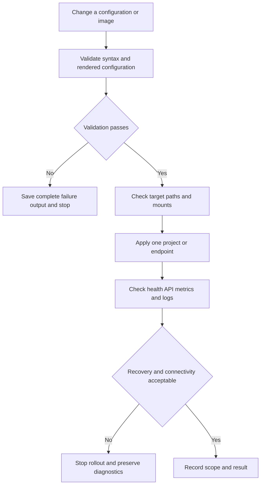

# Validation and Safe Change Checks

This repository does not contain a focused automated test suite for the infrastructure, monitoring, or Server Monitor paths inspected here. Treat validation as narrow, observable smoke checking: validate configuration before applying it, preserve complete command output, and make disruptive checks only during an approved maintenance window. Do not put tokens, passwords, private keys, or credential-bearing output into tickets, screenshots, or this page.

## Safe validation flow



*Caption: a fail-closed sequence for configuration changes and runtime smoke checks.*

Use a temporary output directory outside the repository when capturing diagnostics. For example:

```bash
set -o pipefail
mkdir -p /tmp/homelab-validation
```

Avoid `set -x` and redact environment dumps: the deployment compose file mounts an SSH directory into `deploy-agent`, and command output can expose paths or credentials even when the command itself has no secret argument.

## Compose configuration

Run validation from each project directory, not from an arbitrary parent. The repository uses the Compose plugin (`docker compose`) in the Ansible playbooks, and the install and update workflows enumerate separate projects. For a changed project:

```bash
cd /path/to/project

docker compose config > /tmp/homelab-validation/compose-config.txt

docker compose ps
```

`docker compose config` is the first gate: retain its full stderr on failure and do not continue to `up`. Then apply the smallest possible scope:

```bash
docker compose up -d

docker compose ps

docker compose logs --no-color --tail=200
```

For `minecraft`, verify that the server publishes host port `55555` to container port `25565`, persists data under `./data`, and that `minecraft-backup` can only read that data while writing to `./backups`. The backup container waits for the Minecraft service's health condition; a restart or image change should therefore be checked for both services, not only the game container (`minecraft/docker-compose.yml#L1-L34`). Never paste logs containing user or network metadata into public documentation.

For `server-monitor`, `docker compose config` must be followed by checks for the host-dependent bind mounts before startup. The compose definition requires `/var/run/docker.sock`, `/proc`, `/sys`, `/mnt/disk1`, `/mnt/disk2`, the D-Bus socket, the WireGuard directory, `/usr/bin/wg`, and the deployment project/SSH mounts. It also assumes host networking identity through `host.docker.internal`, host PID visibility, and the configured `sda`/`sdb` and `sdc` device names (`server-monitor/docker-compose.yml#L1-L43`). Check without printing file contents:

```bash
for path in /var/run/docker.sock /proc /sys /mnt/disk1 /mnt/disk2 \
  /run/dbus/system_bus_socket /home/sparrow/HomeLab/vpn/wireguard /usr/bin/wg \
  /home/sparrow/HomeLab /home/sparrow/.ssh; do
  test -e "$path" || { printf 'missing: %s\n' "$path" >&2; exit 1; }
done
```

## Ansible syntax and target assumptions

The configured inventory has one `server` host, `localhost`, using a local connection. The default Ansible configuration also disables host-key checking and fixes the Python interpreter to `/usr/bin/python3` (`ansible/inventory.ini#L1-L2`; `ansible/ansible.cfg#L1-L4`). Run syntax checks from `ansible/` so the relative inventory setting is resolved:

```bash
cd /path/to/repository/ansible
ansible-inventory --list
ansible-playbook --syntax-check install-homelab.yml
ansible-playbook --syntax-check update-server.yml
```

Before a check or apply, confirm the target and privilege assumptions without exposing variables:

```bash
ansible server -m ansible.builtin.ping
ansible server -b -m ansible.builtin.command -a 'id -u'
ansible server -m ansible.builtin.command -a 'python3 --version'
```

`install-homelab.yml` installs Docker and packages, creates directories from `homelab_path`, starts a fixed list of Compose projects, then builds Server Monitor (`ansible/install-homelab.yml#L11-L32`; `ansible/install-homelab.yml#L85-L138`). It does not define `homelab_path` in the play, so supply and review that variable through the normal inventory or extra-variable mechanism before execution; do not put sensitive variable files or their contents in evidence. Its directory ownership also assumes the `sparrow` user exists. A safer preview is:

```bash
ansible-playbook install-homelab.yml --check --diff -e 'homelab_path=/home/sparrow/HomeLab'
```

Use `--check --diff` as a preview, not proof that Docker Compose commands will succeed: command tasks and external package/repository behavior still require a controlled live check. The Docker repository is selected from the host distribution release and architecture, so confirm those facts before changing platform assumptions (`ansible/install-homelab.yml#L40-L71`).

`update-server.yml` pulls and recreates a hard-coded set of `/home/sparrow/HomeLab` projects and marks image pulls unchanged while printing pull results (`ansible/update-server.yml#L6-L38`). Before running it, verify every listed directory and its `compose.yaml`/`docker-compose.yml`; run one project manually first when possible. The update is not a dry-run and can recreate services, so preserve its complete output and use a rollback or image pinning plan before invoking it.

## Monitoring connectivity and metrics

Prometheus scrapes `node-exporter:9100`, `smartctl-exporter:9633`, and `fail2ban-exporter:9191` every 15 seconds (`monitoring/prometheus/prometheus.yml#L1-L15`). Validate the YAML with the installed Prometheus tool when available, then query the running Prometheus instance without including credentials:

```bash
promtool check config /path/to/repository/monitoring/prometheus/prometheus.yml
curl --fail-with-body http://127.0.0.1:9090/-/ready
curl --fail-with-body 'http://127.0.0.1:9090/api/v1/targets'
```

If the endpoint is not published on loopback, use an approved local access path rather than adding a new public exposure. In the targets response, check each configured job's health and inspect the target error field. A valid YAML file does not prove DNS, container-network reachability, exporter availability, or useful metric content.

The Server Monitor metrics endpoint aggregates CPU, memory, root and configured storage disks, uptime, temperature, Docker containers, WireGuard, Plex, hostname, and a timestamp (`server-monitor/backend/app/main.py#L34-L36`; `server-monitor/backend/app/metrics.py#L431-L444`). Its Docker result explicitly reports `available: false` on Docker API failure; missing storage mounts are omitted, and Plex separately checks systemd and `/identity` with a TCP fallback (`server-monitor/backend/app/metrics.py#L99-L128`; `server-monitor/backend/app/metrics.py#L169-L191`; `server-monitor/backend/app/metrics.py#L221-L267`). Therefore test both normal and expected-degraded responses rather than treating a partial JSON response as full health:

```bash
curl --fail-with-body http://127.0.0.1:8080/api/health
curl --fail-with-body http://127.0.0.1:8080/api/metrics
```

Check that the response is JSON and that `docker.available`, storage entries, and `plex.web.available` reflect the host state. Do not infer that an absent disk entry is healthy: the collector returns no entry when a configured mount is unavailable.

## API health, actions, and recovery behavior

`GET /api/health` returns `{"status":"ok"}`; `/api/metrics` collects synchronously. The backend proxies `POST /api/actions/update` and `GET /api/actions/status` to `deploy-agent` with a five-second timeout and returns HTTP 503 when that dependency is unavailable (`server-monitor/backend/app/main.py#L29-L58`). Check the read-only paths first:

```bash
curl --fail-with-body http://127.0.0.1:8080/api/health
curl --fail-with-body http://127.0.0.1:8080/api/actions/status
curl --fail-with-body http://127.0.0.1:9000/status
```

Only in a controlled window, and only after confirming the action is intended, exercise the update endpoint:

```bash
curl --fail-with-body -X POST http://127.0.0.1:8080/api/actions/update
```

The deploy agent persists a small JSON status file, atomically replaces it via a temporary file, starts the deploy script asynchronously, and transitions to `completed` or `error` when the child exits. A startup with status `running` marks the prior update interrupted; a second update request while running reports that an update is already started (`server-monitor/deploy-agent/app/main.py#L17-L21`; `server-monitor/deploy-agent/app/main.py#L24-L65`). Poll until a terminal state and retain the status response plus deploy-agent logs, but redact messages and paths if they contain operationally sensitive data:

```bash
for i in $(seq 1 30); do
  curl --fail-with-body http://127.0.0.1:9000/status
  sleep 2
done
```

A 500 from `POST /update` means the script could not be started; it is not evidence that deployment ran. Confirm the status and container logs before retrying.

## Mount availability and service recovery

Validate mounts from both host and container perspectives. Host checks establish existence; container checks establish that the bind mount is visible and readable:

```bash
findmnt /mnt/disk1 /mnt/disk2

docker compose exec -T server-monitor sh -c \
  'test -r /proc && test -r /sys && test -d /mnt/disk1 && test -d /mnt/disk2'
```

The metrics collector reads `/sys`, disk mounts, Docker, systemd/Plex, and WireGuard; a missing or restricted mount can degrade only that metric or can prevent startup depending on the runtime (`server-monitor/backend/app/metrics.py#L17-L34`; `server-monitor/backend/app/metrics.py#L321-L337`; `server-monitor/backend/app/metrics.py#L340-L414`). Preserve the exact failing command and container status instead of compensating by changing mount paths ad hoc.

For recovery, use the project that changed and inspect before restarting:

```bash
docker compose ps

docker inspect --format '{{.Name}} {{.State.Status}} {{.State.Restarting}} {{.State.ExitCode}}' server-monitor deploy-agent

docker compose logs --no-color --tail=200 server-monitor deploy-agent
```

If a service is unhealthy or exited, restart only that service and recheck its dependency and API:

```bash
docker compose up -d server-monitor deploy-agent
docker compose ps
curl --fail-with-body http://127.0.0.1:8080/api/health
curl --fail-with-body http://127.0.0.1:8080/api/metrics
```

The Compose services use `restart: unless-stopped`, but that policy does not repair invalid configuration, unavailable host mounts, failed image pulls, or a broken dependency. For Minecraft, check both the server and backup service after recovery; for monitoring, check Prometheus target health after exporters return. Record the change scope, command exit status, affected services, endpoint results, and any rollback decision—without credentials or secret-bearing logs.
