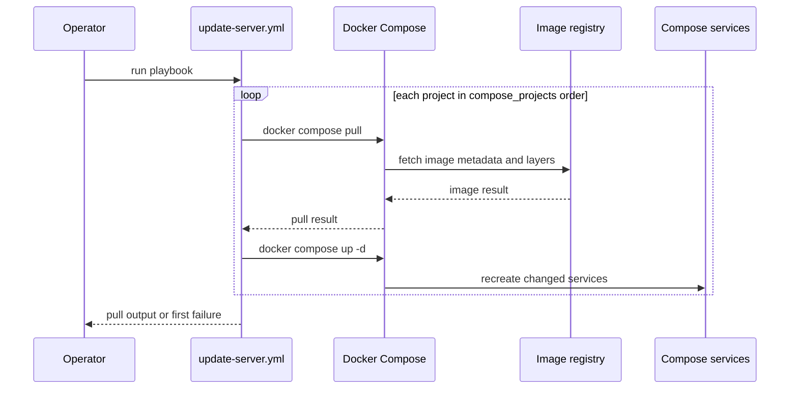
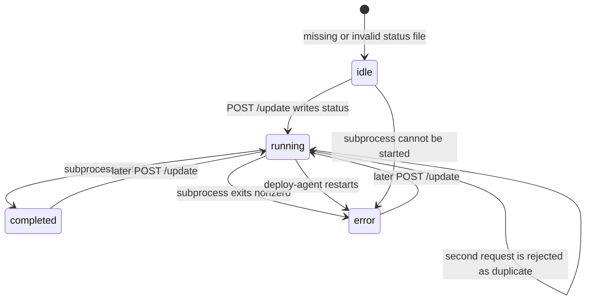

# Provision, Deploy, Update, and Troubleshoot Workflows

This page covers three different operations that are easy to conflate:

- **Provisioning** installs the host prerequisites, creates runtime directories, starts the existing Compose projects, and builds `server-monitor`.
- **Maintenance updating** pulls images and recreates the configured Compose projects, but does not rebuild `server-monitor` from source.
- **Project deployment** is the button-driven `server-monitor` flow: the backend asks `deploy-agent` to run `deploy.sh`, which pulls the Git checkout and rebuilds only the `server-monitor` service.

The repository assumes a `server` Ansible group (the checked-in inventory maps it to local execution) and a host checkout rooted at `/home/sparrow/HomeLab`. Verify those path assumptions before running a playbook.

## Provisioning: install prerequisites, then start services

`ansible/install-homelab.yml` runs against `server` with privilege escalation. It installs the base packages (including Git, Python, `fail2ban`, and disk tooling), adds Docker's signed repository, installs Docker Engine and Compose, enables and starts Docker, and adds the `sparrow` user to the `docker` group. It then creates the configured runtime directories under `{{ homelab_path }}` for Plex, monitoring, Portainer, Syncthing, Minecraft, VPN, and `server-monitor` (the directory owner and group are `sparrow`).

The first Compose start runs `docker compose up -d` in the listed project directories. `server-monitor` is deliberately last and uses `docker compose up -d --build`, so its image is built from the checkout before the service is started. The task list is sequential: an earlier failed command stops the play before later projects are attempted. A successful `up -d` is not a health check; follow it with the service/status checks described below.

## Scheduled or manual image refresh

The maintenance entrypoint is `ansible/update-server.yml`. It targets the same `server` group with `become: true`, but its project list is explicit and rooted at `/home/sparrow/HomeLab`. For each project, Ansible runs:

```text
docker compose pull
docker compose up -d
```

Pull results are registered and printed, while the pull task is marked `changed_when: false`; the subsequent recreate task is still an operational change. The loop is not a transaction: projects are processed in list order, and a failure can leave earlier projects already recreated while later projects were not reached.

This playbook refreshes published Compose images. It does **not** run `--build`, so changes to the `server-monitor` source or Dockerfile require the deployment path or an explicit build command. There is no scheduler in the playbook itself; invoke it manually or from an external scheduler after checking the project paths and preserving command output.



*The update path is sequential and project-scoped, not an atomic fleet update.*

## Button-driven server-monitor deployment

The web UI posts to `/api/actions/update`. The backend uses `DEPLOY_AGENT_URL` (default `http://deploy-agent:9000`) to call `POST /update` with a five-second timeout. A successful agent response is returned to the browser; the UI then navigates to `/update-status`. The status page polls `/api/actions/status` every three seconds with cache disabled. It returns to `/` on `completed`, exposes the persisted message and a back button on `error`, and keeps polling while the status is `running` or `idle`.

The backend is a proxy, not the owner of deployment state. If the agent cannot be contacted or its request fails, both action endpoints return HTTP 503 with a generic unavailable-service detail. The UI reports that the update could not be started. This includes an agent restart, network/DNS failure, or a non-success response from the agent.

The Compose boundary matters operationally. `server-monitor` listens on container port 8000 published as host port 8080 and points at `http://deploy-agent:9000` on the Compose network. The agent publishes port 9000, mounts the host checkout at `/home/sparrow/HomeLab`, mounts the Docker socket, and is configured with `DEPLOY_STATUS_FILE` at `/home/sparrow/HomeLab/server-monitor/.deploy-status.json`. The agent therefore has a powerful host deployment boundary; keep that service reachable only where the intended control plane can reach it and do not expose its mounted credentials or host capabilities in diagnostics.

### Agent lifecycle and failure states

`deploy-agent` serializes status decisions with `status_lock`. A missing or invalid status file reads as `{"status": "idle"}`. Starting an update writes `running` before launching `deploy.sh` with `subprocess.Popen` in a new session, then returns immediately. A daemon waiter changes the state to `completed` for exit code 0, or to `error` with the exit code for any non-zero result.

A second request while the status is `running` is not a second deployment: it returns `status: started` with an “already running” message. If process creation raises `OSError`, the agent writes `error` and returns HTTP 500. On agent startup, a previously persisted `running` state is treated as an interrupted deployment and changed to `error`; this prevents a restart from leaving the UI indefinitely busy.



*The persisted status is the deploy-agent lifecycle; `running` is never allowed to survive an agent restart.*

The invoked script is intentionally small and fail-fast:

```text
cd /home/sparrow/HomeLab
git pull
cd /home/sparrow/HomeLab/server-monitor
docker compose up -d --build --no-deps server-monitor
```

`set -e` means a failed `git pull` prevents the build, and a failed build or recreate exits non-zero and becomes agent status `error`. `--no-deps` limits the Compose action to `server-monitor`; it does not refresh or restart its dependencies. A successful command sequence only proves the script exited zero, not that every application-level health check passed.

## Practical diagnosis

1. **Playbook does not start.** Run from the Ansible directory, validate inventory connectivity and variables such as `homelab_path`, and use `ansible-playbook --syntax-check install-homelab.yml` or `ansible-playbook --syntax-check update-server.yml`. Confirm every listed project directory has its Compose file and that Docker is running.
2. **Provisioning stops partway through.** Read the failed task and command output. Because task loops are sequential, correct the package, repository, permissions, or Compose error and rerun; inspect already-created directories and services rather than assuming rollback.
3. **Image update is incomplete.** Compare the failed project with the ordered `compose_projects` list. Rerun after fixing registry access, Compose configuration, disk space, or daemon health. Remember that `pull` plus `up -d` is not a source rebuild.
4. **The UI reports the update service is unavailable.** Check `server-monitor` logs and the `deploy-agent` container, Compose-network name resolution, and whether port 9000 is listening. From the server-monitor container, verify the configured `DEPLOY_AGENT_URL`; do not troubleshoot by printing mounted SSH material or other credentials.
5. **Status is `error`.** Read the JSON status message, then inspect deploy-agent logs and the script's subprocess output. A non-zero result normally means Git access/pull failed or Docker build/recreate failed. Check repository state, branch/remote access, Docker daemon availability, build context, disk space, and the `server-monitor` Compose definition.
6. **Status remains `running` after a restart.** It should be converted to an interruption error during agent startup. If it is not, inspect write permissions for the status-file parent and whether the running container is using the expected `DEPLOY_STATUS_FILE` path. The status file is atomically replaced through a temporary file, so also check filesystem space and permissions.
7. **Deployment says `completed` but the service is unhealthy.** Check `docker compose ps` and `docker compose logs server-monitor` in `/home/sparrow/HomeLab/server-monitor`, then query `/api/health` and inspect `/api/metrics`. `completed` records subprocess success; it is not an application health assertion.

## Safe change points and invariants

- Keep the install and update project lists aligned when adding a new Compose project, unless the omission is intentional and documented.
- Treat `server-monitor` source deployment separately from image refresh: preserve `--build --no-deps` when the goal is only to rebuild that service.
- Preserve the agent's status-file locking and atomic replacement when changing status handling; readers must see a complete JSON document, not a partial write.
- Keep the backend proxy timeout and 503 boundary explicit so an unavailable agent does not become an unbounded browser request.
- After changing the deployment script, agent API, Compose wiring, or Ansible lists, run the focused validation commands in `/openwiki/testing/validation.md` and perform one controlled update against a non-critical project where possible.

## Source map

- Bootstrap and project startup: `ansible/install-homelab.yml`
- Image refresh and recreate order: `ansible/update-server.yml`
- Backend proxy endpoints: `server-monitor/backend/app/main.py`
- Deployment state owner and subprocess lifecycle: `server-monitor/deploy-agent/app/main.py`
- Git pull and targeted rebuild: `server-monitor/deploy-agent/scripts/deploy.sh`
- Network, mounts, ports, restart policy, and deployment status path: `server-monitor/docker-compose.yml`
- Browser update and polling behavior: `server-monitor/frontend/js/app.js` and `server-monitor/frontend/js/update-status.js`
